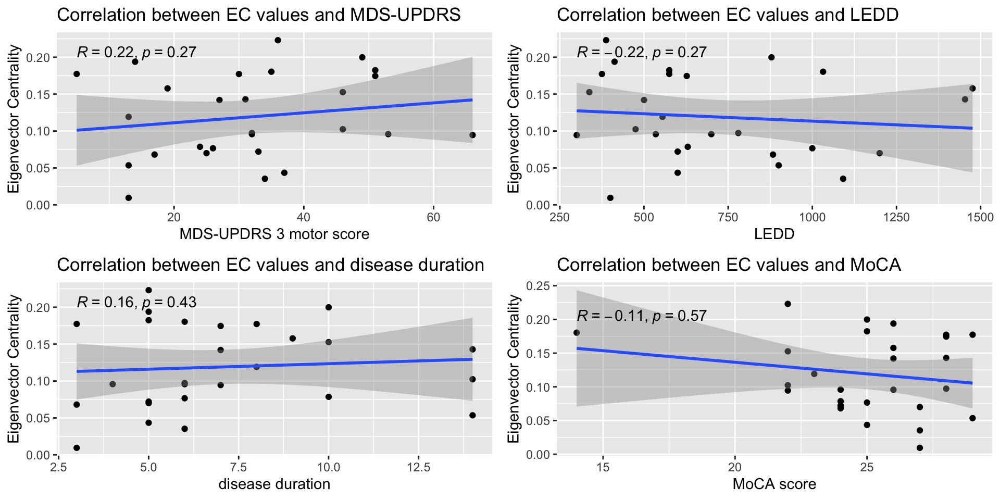

# Abstract

**Background**: Altered resting-state functional connectivity has been reported in Parkinson’s disease (PD), including changes in eigenvector centrality within temporoparietal regions. While functional magnetic resonance imaging (fMRI) remains the standard for studying resting-state networks, functional near-infrared spectroscopy (fNIRS) is becoming increasingly used to study these networks. However, findings across resting-state fNIRS studies are heterogeneous, and replication of resting-state fMRI results remain limited.

**Objective**: To replicate previously reported differences in eigenvector centrality in resting-state fMRI studies between healthy controls and individuals with PD and examine associations with clinical and functional measures using resting-state fNIRS.

**Methods**: Fifty-seven participants (30 controls, 27 PD) underwent resting-state fNIRS measurements across two sessions, measuring left and right hemispheres separately. Pre-registered whole-hemisphere network analyses were conducted to assess group differences in eigenvector centrality and correlations with clinical and functional measures.

**Results**: The largest difference in eigenvector centrality between groups was observed in the inferior parietal lobule, but in the opposite hemisphere than expected and not significant after multiple comparison correction. No hypothesized correlations were observed. Exploratory resting-state analyses indicated differences in prefrontal core–periphery structure in PD. Several factors likely contributed to discrepancies, including limited sample size and intra-hemispheric coverage.

**Conclusions**: Previously reported eigenvector centrality differences were not replicated. Results highlight uncertainty in whole-brain network metrics derived from fNIRS and underscore the need for larger sample sizes. Observed prefrontal core-periphery differences might relate to frontoparietal network alterations in PD. Future studies may benefit from more targeted, hypothesis-driven approaches such as seed-based analyses, which demonstrate greater reliability across modalities.

**Highlights**

- Resting-state connectivity in people with Parkinson's disease studied with fNIRS
- Prior resting-state fMRI connectivity findings could not be replicated with fNIRS
- Exploratory findings of prefrontal network changes in people with Parkinson's disease

# Introduction

When the brain is at rest, it has been shown that there are synchronized low-frequency oscillations of neuronal activity, which can be measured via the +BOLD [@biswal1995]. These oscillations exhibit consistent structural patterns across individuals and are referred to as +rsFC [@damoiseaux2006]. Several +rsFC networks are known in humans and are involved in a wide variety of functions, from memory and executive functioning to motor function [@damoiseaux2006; @uddin2019], and have been extensively studied using +fMRI [@biswal2025].

For some neurodegenerative diseases, these metrics have shown some promise as a biomarker: for Alzheimer’s disease, alterations in the default mode network have been found, and in +PD, alterations in limbic and motor related networks have been found [@hohenfeld2018]. For +PD, a meta-analysis of a range of resting-state +fMRI metrics found a convergence of abnormal connectivity patterns converging in the bilateral posterior +IPL when considering people with +PD off medication, but constrained to the right +IPL when on medication [@tahmasian2017]. The direction of effect also depended on medication: specifically, metrics were found to increase compared to controls while off medication, and decrease while on medication [@tahmasian2017]. This is something also found in a study comparing eigenvector centrality between people with +PD and controls, where eigenvector centrality was found to be lower in the +STG, the +SMG, and the putamen in people with +PD when on medication [@ballarini2018].

While +fMRI remains the most established method for studying resting-state networks, there has been increased investigation into the possibility of studying +rsFC using +fNIRS [@albrecht2025; @wang2024; @yeung2020], an optical neuroimaging method based on detecting changes on +HbO and +HbR concentrations in the cortex [@jobsis1977]. Progress has been made in characterizing the test-retest reproducibility of +rsFC metrics measured with +fNIRS [@zhang2011; @zhang2011a], identifying optimal processing methods [@novi2023; @lanka2022; @paranawithana2022; @blanco2018; @santosa2017], and characterizing resting-state networks [@abdalmalak2022; @butters2026]. Some studies have compared +rsFC metrics and networks identified with +fNIRS to those measured with +fMRI [@kotsogiannis2026; @uchitel2022; @duan2012], with two studies finding a large degree of overlap between network topological parameters and network maps [@uchitel2022; @duan2012], and another finding less agreement for finer-scale nodal parameters but better agreement for large-scale parameters such as global connectivity patterns and major functional subnetworks [@kotsogiannis2026].

However, these comparisons with +fMRI literature have focused on healthy participants, and because resting-state +fNIRS studies are still very heterogeneous  [@albrecht2025], there is a lack of rigorous comparison between resting-state alterations reported in the literature for neurodegenerative disease, and +rsFC metrics in measured with +fNIRS. Thus, this pre-registered study set out to test hypotheses based on the +fMRI literature on resting-state alterations in people +PD, in a cohort of people with +PD measured with resting-state +fNIRS.

# Material and methods

## Participants

People with +PD (≥ 60 years, clinical diagnosis ≥ 6 months prior to enrollment) and +HC were re-invited from the Park-MOVE cohort [@franzen2023], who had previously participated in an +fNIRS study on complex walking. Exclusion criteria for the +HC group were medical conditions affecting gait and balance, or severe hearing or visual impairment. Exclusion criteria for people with +PD included other neurological diseases, severe hearing or visual impairment, other medical conditions affecting gait and balance, and speech difficulties such as aphasia. Participants with +PD were on their usual medication schedule.

## Pre-registration and hypotheses

A pre-registration of hypotheses based on +fMRI literature on resting-state alterations in people with +PD was made at the start of data collection, and is available at +OSF (<https://osf.io/wtsy7/overview?view_only=a8b2c4e92aa440cc87c9448d2e03bd04>). No deviations from the pre-registration are noted.

Based on the literature, we hypothesized that there is a difference in eigenvector centrality between people with +PD and +HC [@ballarini2018] (H1). Specifically, we expected a lower eigenvector centrality in people with +PD compared to +HC in channels most closely corresponding to the +MNI coordinates (48 17 -13) in the +STG and (-63 -25 38) in the +SMG [@ballarini2018] (H2.1). Furthermore, based on a meta-analysis (including studies utilizing network and graph metrics, regional homogeneity, and amplitude of low-frequency fluctuations), we hypothesized that the lower eigenvector centrality could be located around +MNI coordinates (46 -64 26) in the +IPL [@tahmasian2017] (H2.2).

Finally, we hypothesized that eigenvector centrality in people with +PD is negatively correlated with motor symptom severity, medication, disease duration, and global cognition (H3).

## Experimental procedure

Data collection took place at the uMOVE core facility, Karolinska University Hospital, Solna, Stockholm. All data was collected during a single experimental session. Collected data consisted of resting-state +fNIRS data, cognitive screening data ([+MoCA]{.short}), and a clinical test of balance (Mini-Balance Evaluation Systems Test, Mini-BESTest). The participants with +PD also performed the Movement Disorder Society sponsored revision of the Unified Parkinson’s Disease Rating Scale (MDS-UPDRS) to assess disease severity at the time of measurement. The side of predominant motor symptoms was assigned with a minimum 2-point difference between MDS-UPDRS III items which are scored on each side [@poletti2013]. Handedness of participants was assessed with the +EHI [@oldfield1971].

## Data acquisition

The +fNIRS system used was a NIRSport2 (NIRx) with 16 sources and 15 detectors, with 8 short-separation detectors. Optodes transmitted light at 760 and 850 nm. Sampling frequency was 7.6 Hz. Because optodes were not sufficient to ensure full-brain coverage, two measurements were taken in succession with one montage for the left hemisphere, and one for the right hemisphere ([Figure @fig:rs-montage]). Each resting-state measurement lasted for 10 minutes. The hemisphere which was measured first alternated across participants, with the selection determined by the hemisphere most recently used for each cap size. There was about 15 minutes between each measurement.

The resting-state measurements took place in a calm, dimly lit room, with participants seated in an office chair, legs placed on a leg rest to decrease movement. Eyes were closed, and participants were blindfolded as well. Ear plugs were used to shield from ambient noise. Participants were instructed not to focus on any special thought, let the mind wander, and to not fall asleep.

{#fig:rs-montage}

## Data preprocessing

Preprocessing of resting-state +fNIRS data was performed with the MATLAB NIRS AnalyzIR toolbox (forked version; see Data availability for details) [@santosa2018]. Raw data was trimmed at the start and end of the measurement with 10 seconds on each side to avoid noise from position adjustments and similar. Raw data was then converted into optical density and into ΔHbO and ΔHbR using the modified Beer-Lambert law [@delpy1988]. The +DPF was set to depend on age [@scholkmann2013].

Data quality was assessed using MNE-NIRS (v0.7.1) [@gramfort2013; @luke2021]. The +SCI was calculated on a per-channel basis and the percentage of bad channels ([+SCI]{.short} < 0.7) among participants was plotted on the montage (supplementary). The worst quality channels (below acceptance criteria for >20% of subjects) were discarded from further analysis, 6 in total, leaving 42 long channels remaining (details of discarded channels in supplementary material). Moreover, because noise in short-channels may transfer noise into the signal of interest during short-channel regression, quality of the short-channel data was further assessed using their power spectrums [@novi2023] and channels were discarded if they lacked a clear heart-rate peak around 1 Hz ([Figure @fig:short-ch-example]) (amount of discarded short-channels across all sessions median = 0, IQR = 0-1, range = 0-6).

{#fig:short-ch-example}

## Data analysis

All-to-all channel correlation matrices were calculated from ΔHbO2 values using the connectivity module in the NIRS toolbox, with prewhitening and short-channel regression [@santosa2017; @lanka2022].

To obtain graph metrics, in particular eigenvector centrality, correlation matrices were fed into the BRAPH2.0 (v2.0.0.b2) [@mijalkov2017; @chang2025] pipeline Connectivity Comparison WU (weighted undirected). This pipeline compares two groups of subjects by constructing weighted undirected graphs from input connectivity data, in this case the correlation matrices. Brain atlases for the BRAPH2.0 pipeline were obtained by exporting the projected +MNI coordinates of channels in the used montages via AtlasViewer (v2.44.0) [@aasted2015].

Differences in eigenvector centrality values were compared by non-parametric permutation tests with 1000 permutations, considered significant for a two-tailed t-test at p < .05. To account for multiple comparisons in the network results, false discovery rate (FDR) correction was applied, and the network was tested at q < .05. 

To test correlation hypotheses in H3, correlation between eigenvector centrality and motor symptom severity (MDS-UPDRS III motor score), medication ([+LEDD]{.short}), disease duration and global cognition ([+MoCA]{.short} score) were calculated. Correlations were calculated for those channels showing the largest differences in eigenvector centrality values between the groups.

Finally, as an exploratory analysis in addition to the eigenvector centrality comparison, the analysis pipeline was run for all other available global and nodal BRAPH graph metrics and compared between groups. 

Statistical analysis of demographic data and BRAPH2.0 output was performed in R [@rcoreteam2022] (v4.5.2).  Normality of data was assessed with the Shapiro-Wilk normality test and visually with q-q plots. Effect sizes were calculated using the *effectsize* package [@ben-shachar2020], with Hedges’ g for continuous variables and Cohen’s h for proportions. Visualizations of nodal effect locations were performed in Python (v3.14.5) using the *mni-to-atlas* library on the extended Human Connectome Project multimodal parcellation atlas (HCPEx) [@huang2022b].

# Results

## Participants

In total, 57 participants took part in the study (Table 1). The participants with +PD  had poorer balance performance compared to +HC (median Mini-BESTest score 20 in participants with +PD vs 25 in +HC, p < 0.001) as well as lower global cognitive function compared to +HC (median MoCA score 25 in participants with +PD vs 27 in +HC, p = 0.013). Participants were right-handed ([+EHI]{.short} laterality quotient > 40). Motor symptom predominance in participants with +PD  was mixed (left-predominant 40.7%, no asymmetry 22.2%, right-predominant 37.0%).

| Variable                              | Control (N = 301) | Parkinson (N = 271) | p-value2 |
|--------------------------------------|------------------|---------------------|--------|
| Sex, female                       | 10 (34%)         | 10 (37%)            | 0.8    |
| Age, yrs                             | 68 (7)           | 70 (7)              | 0.4    |
| Weight, kg                           | 75 (14)          | 77 (19)             | 0.7    |
| Height, cm                           | 175 (10)         | 175 (9)             | 0.8    |
| MoCA score                           | 27 (26, 28)      | 25 (24, 27)         | 0.013  |
| Mini-BESTest score                   | 25 (24, 26)      | 20 (18, 24)         | <0.001 |
| Handedness laterality quotient       | 88 (69, 100)     | 86 (68, 100)        | 0.9    |
| MDS-UPDRS III motor score            | NA           | 32 (15)             |        |
| LEDD                                 | NA       | 600 (475, 900)      |        |
: Table 1 - Demographics

1. n (%); Mean (SD); Median (Q1, Q3)
2. Pearson’s Chi-squared test; Welch Two Sample t-test; Wilcoxon rank sum test
Abbreviations: MoCA, Montreal Cognitive Assessment; Mini-BESTest, Mini-Balance Evaluation Systems Test, MDS-UPDRS, Movement Disorder Society sponsored revision of the Unified Parkinson’s Disease Rating Scale; LEDD, levodopa equivalent daily dose

## Eigenvector centrality

Differences in eigenvector centrality values between the groups ([Figure @fig:eigenvector-diff]a, supplementary table 1 and 2) revealed a single channel with a significantly lower value in the participants with +PD compared to +HC (SRC10-DET9, HC 0.153, PD 0.119, difference −0.034, p .034). Effect size was moderate but highly uncertain (Hedges' g = 0.56, 95% CI [0.03, 1.08]). The center of this channel was according to AtlasViewer simulations located at +MNI coordinates (-39 -54 46) ([Figure @fig:eigenvector-diff]b). This location corresponded to Area_PFm_Complex_L in the HCPEx atlas, located in the +IPL. However, compared to hypothesized difference in the right +IPL (H2.2), it was located in the left +IPL ([Figure @fig:location-comparison]). Furthermore, the channel did not survive FDR-adjustment.

There were no identified correlations between eigenvector centrality and any of the hypothesized correlates motor symptom severity (MDS-UPDRS III motor score), medication ([+LEDD]{.short}), disease duration or global cognition ([+MoCA]{.short} score) ([Figure @fig:correlation]).

{#fig:eigenvector-diff}

{#fig:location-comparison}

{#fig:correlation}

## Exploratory analysis

Exploratory analyses of additional graph metrics revealed one channel in the left hemisphere ([Figure @fig:core-periphery-diff]a) that remained after FDR-correction. This channel showed a higher proportion of subjects classified as belonging to the network core in participants with +PD compared to +HC (core–periphery nodal value; SRC3-DET1, HC 0%, PD 19%, difference 19%, FDR p < .02). Effect size was large (Cohen's h = 1.73, 95% CI [0.81, 2.64]). The channel was located at +MNI coordinates (-21, 52, 1) ([Figure @fig:core-periphery-diff]b). This location corresponded to Area_posterior_10p_L in the HCPEx atlas, located in the left +PFC.

{#fig:core-periphery-diff}

# Discussion

In this study, pre-registered hypotheses based on resting-state +fMRI findings in people with +PD were tested in a cohort of participants with +PD measured with resting-state +fNIRS. Network analysis revealed limited group differences between participants with +PD and +HC. While a single channel in the left +IPL showed reduced eigenvector centrality in participants with +PD, this effect did not survive correction for multiple comparisons, and no associations were found with motor symptom severity, medication, disease duration, or cognition. Exploratory analysis of other graph metrics indicated an increased core–periphery involvement in the left +PFC in participants with +PD.

## Previous resting-state fMRI findings could not be replicated

Although the largest difference in eigenvector centrality between +HC and participants with +PD was located in the +IPL as hypothesized in H2.2, it was in the opposite hemisphere than expected ([Figure @fig:location-comparison]), and the result was not significant when controlling for multiple comparisons at FDR p < .05. None of the hypothesized correlations with motor symptom severity, medication, disease duration or global cognition were found either. ([Figure @fig:correlation]) Thus, the pre-registered hypotheses were not supported by the findings of this study.

The hypothesized locations of lower eigenvector centrality in participants with +PD compared to controls in the +SMG and +STG (H2.1) were based on a single study. This study specifically compared eigenvector centrality between controls and people with +PD using a whole-brain +fMRI analysis [@ballarini2018]. In contrast, the location in the +IPL (H2.2) was based on an +ALE meta-analysis of 28 resting-state +fMRI studies, which used a range of graph metrics and analysis pipelines [@tahmasian2017]. While the convergent +ALE finding was limited to the right hemisphere in the meta-analysis, a follow-up resting-state functional connectivity analysis using the +ALE finding as a seed region found a symmetric network spanning both hemispheres [@tahmasian2017], including the region of largest difference found in this study ([Figure @fig:location-comparison]). Given the difference in experimental protocol and analysis pipeline compared to the whole-brain +fMRI analysis [@ballarini2018], as well as the large experimental differences between +fMRI and +fNIRS even though both rely on the +BOLD signal, it might be expected that the convergence of more heterogeneous studies more closely aligns with this study using a different modality.

## Sources of discrepancy for replication

A total of 57 participants partook in the study, and although the difference in eigenvector centrality was of moderate effect size (Hedges g = 0.56), it was not significant after FDR-correction. This, and the wide confidence interval of Hedges g [0.03 - 1.08] reflects a highly uncertain effect, and points towards this type of whole-brain (or half-brain) network analysis needing a far larger sample size, better signal to noise ratios, or both. This issue exists in the +fMRI literature as well, where strict correction for multiple comparisons removes many +rsFC findings when performing between-group comparisons [@arabshahi2024].

Even when doing within-group correlations, +fMRI literature points towards roughly 80 or more participants being required in order to examine brain-behavior correlations on a robust manner in task-based analyses [@grady2020], something that likely requires even more participants when correlating +rsFC metrics. This issue of small-n designs when studying brain-behavior associations is also present in +EEG [@guern2026] studies, where small samples produce unstable associations and inconsistent effect sizes. As discussed in Poldrack et al. [@poldrack2017], while sample sizes in neuroimaging research are generally trending upwards, small sample sizes are still prevalent and make replication more unlikely. Although not without challenges [@poldrack2015], pooling shared data on platforms like OpenNeuro [@markiewicz2021] could help tackle these small sample limitations.

Another clear source of discrepancy is the fact that only one hemisphere was measured at one time due to a limited amount of available optodes. Whole-brain network analyses capture both intra-hemispheric and inter-hemispheric connectivity, and homotopic connections (meaning connections between homologous inter-hemispheric regions) are usually strongly correlated [@stark2008]. While +rsFC networks are usually symmetric [@jo2012], positive connections (synchronous fluctuations between time series) have been reported to be stronger intra-hemispherically and negative connections (anticorrelations between time series) stronger inter-hemispherically [@gee2011]. If the findings in the meta-analysis [@tahmasian2017] used for constructing our hypotheses were due to inter-hemispheric connection disruptions rather than intra-hemispheric, our experimental design would fail to capture these. While a less dense bilateral montage could have been used as in [@blum2022] for example, here we opted for a denser intra-hemispheric montage to capture as much of the hemisphere as possible.

Furthermore, this study did not co-register optode placement with anatomical images, meaning placement variation errors and head geometry variation likely contributed to a larger degree of noise in estimating +rsFC metrics, as compared to +fMRI studies.

## Seed-based analyses might be more appropriate

Because of issues with whole-brain network analyses described above, more targeted analyses might be more appropriate to understand differences in +rsFC metrics between healthy people and people with +PD, and to understand the connection between brain networks and behavior. In fact, a recent study comparing whole-head +fNIRS and +fMRI data reached precisely such a conclusion: while certain key features of large-scale network metrics were found, nodal measures differed substantially between modalities [@kotsogiannis2026]. 

Instead, seed-based networks such as the default mode, sensorimotor, and visual networks found better agreement between modalities [@kotsogiannis2026]. These networks have been demonstrated multiple times in +fNIRS [@montero-hernandez2024; @abdalmalak2022; @zhang2011], and have been found to be more reliable in test-retest +fNIRS studies [@zhang2011].

## Left PFC belonged to the core network more often in participants with PD

In the exploratory analysis, it was found that a node in the left +PFC belonged to the core network constructed by the correlation graph (i.e., core-periphery classification) more often in the participants with +PD, as compared to +HC. Specifically, the node was located in the Area_posterior_10p_L in the HCPEx atlas, which is located in the orbitofrontal cortex and can be considered a part of the +FPN [@sanchez-romero2023; @pereira-obilinovic2024]. Interestingly, the region is also part of the network found in the follow-up +rsFC analysis using the meta-analytic +ALE finding as a seed region (which H2.2 was based on) [@tahmasian2017].

The +FPN is one of the core cognitive control networks, acting as a hub that allows for flexibly modulating cognitive control via tight integration with many other functional brain networks [@marek2018]. In +PD, a recent metabolic network connectivity study of seven networks found that the +FPN specifically had an increased connectivity with the +SMN compared to +HC [@chen2024]. Some studies find that +FPN connectivity relates to cognitive function: lower +MoCA scores have been linked with lower intra-network connectivity of the +FPN [@yeager2024], and cognitively stable individuals with +PD display greater network resiliency of the +FPN compared to those with cognitive decline [@cascone2021].

The alterations in +FPN connectivity might also depend on medication: +FPN connectivity is enhanced by dopaminergic treatment [@liu2022b], and differences in functional connectivity within the +FPN has been found to differentiate those who experience dopaminergic treatment-related motor complications in people with +PD compared to those who do not [@demicco2024]. 

The reason why this finding was localized specifically to the left +PFC is unclear. Although the sample studied was right-handed, motor symptom predominance among subjects in which this node was part of the core network was mixed. While the core-periphery finding might be related to +FPN alterations in people with +PD, given the exploratory nature of this finding, targeted replication is needed in order to confirm this.

## Limitations

This study had several limitations. Limited optode coverage restricted data collection and analysis to intra-hemispheric connections, potentially missing the influence of inter-hemispheric connections. Optode placement variation errors and head geometry variation was not quantified via e.g. photogrammetric co-registration, even though head-size adjusted caps were used to minimize the error. Influence from systemic physiology like heart rate and breathing was not measured, and some channels suffered from poor signal quality and were thus excluded.

## Conclusion

This pre-registered resting-state +fNIRS study did not replicate previously reported resting-state connectivity alterations in people with +PD found in +fMRI. Observed effects were highly uncertain, likely due to limited sample size and methodological constraints. An exploratory indication of altered left prefrontal core-periphery involvement might relate to frontoparietal network changes in people with +PD compared to +HC, but this requires targeted replication to confirm. Future studies should prioritize larger samples, improved spatial localization, whole-head coverage, or adopt more focused hypothesis-driven approaches such as seed-based analyses within well-defined networks to improve reliability.

# Data availability

All code is available via <https://github.com/alkvi/fnirs_resting_state_pd> and the open lab notebook at <https://alkvi.github.io/fnirs_resting_state_pd>. The original raw data are not publicly available due to Swedish/EU law, but are located with restricted access in a central repository (<https://doi.org/10.48723/vscr-eq07>), where sharing will be regulated via a data transfer and user agreement upon a reasonable request.

# Acknowledgements

We thank all participants who made this study possible and the uMOVE core facility. We also extend our appreciation to Mite Mijalkov for helpful guidance regarding the BRAPH toolbox.

# References
