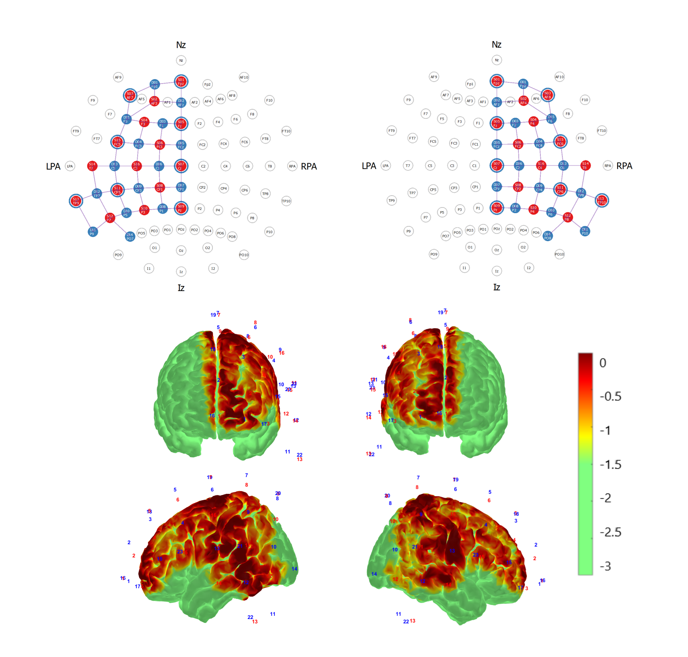
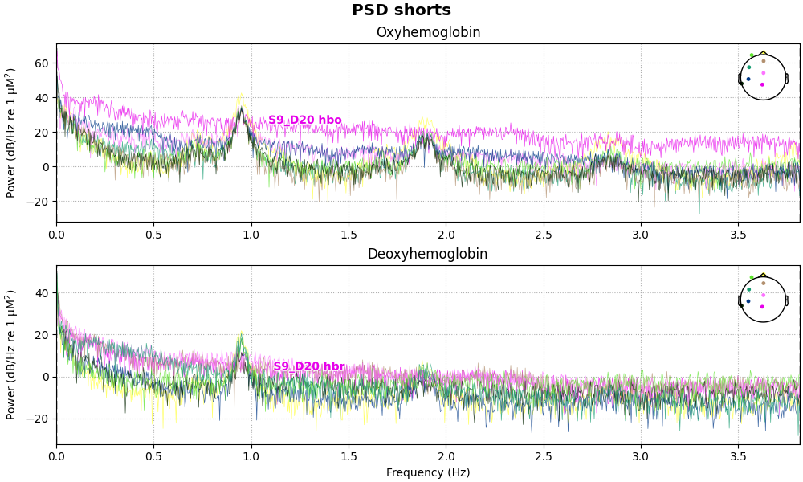
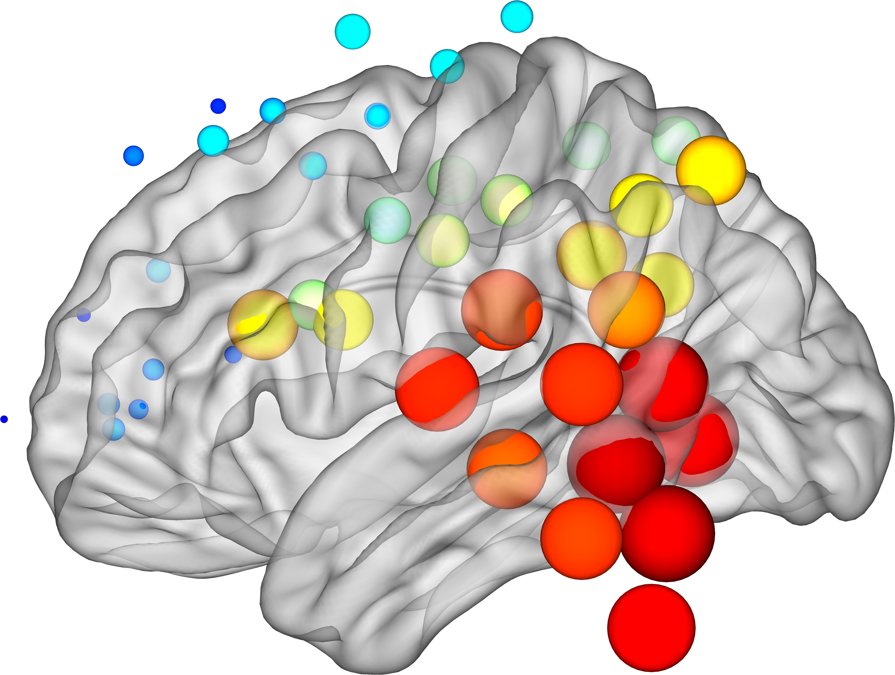
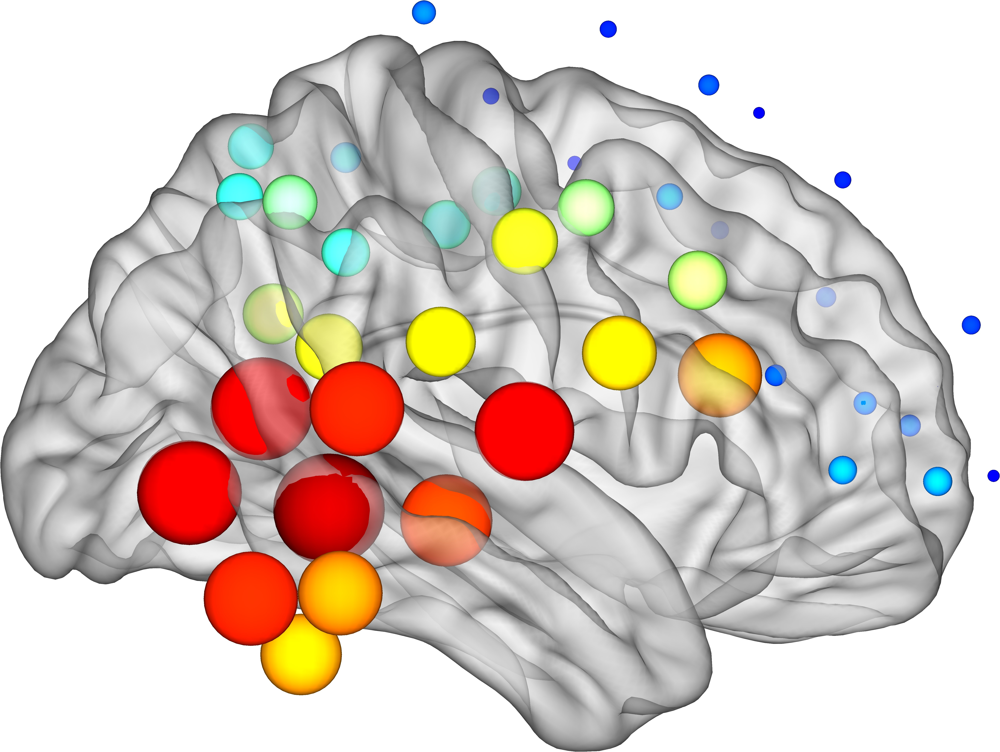
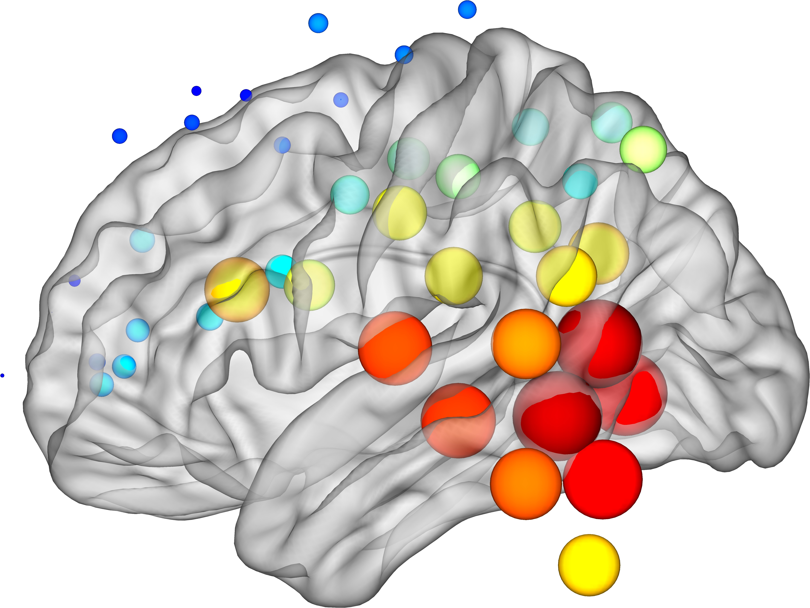
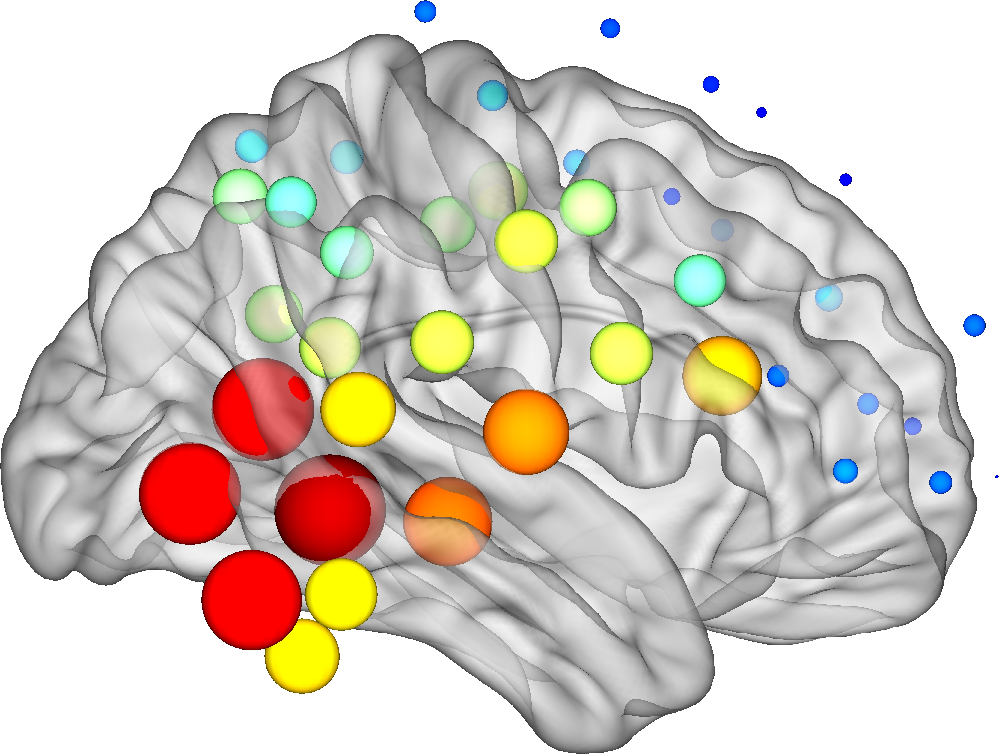
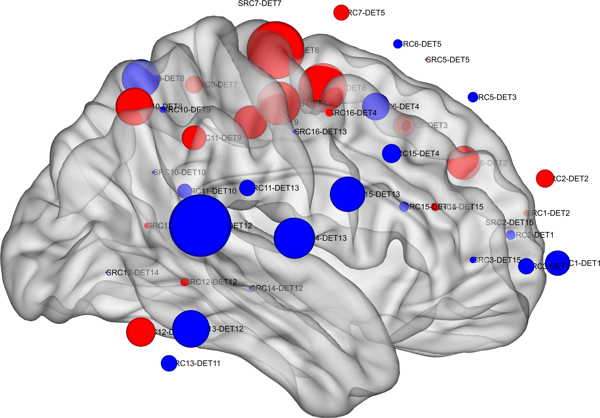

```{css}
/*| echo: false */
figcaption {
  margin: auto;
  text-align: center;
}
```

```{r setup, include=FALSE}
knitr::opts_chunk$set(echo = TRUE)
knitr::opts_chunk$set(fig.width=10, fig.height=5)

# load library
library(dplyr)
library(tidyr)
library(readxl)

library(ggpubr)
library(ggplot2)
library(cowplot)

library(arsenal)
library(gt)

library(effsize)

```

# Introduction

This notebook is intended to store results and code for a pre-registered resting-state fNIRS study comparing healthy and Parkinson's disease.

Pre-registration (created Mar 4, 2024, 11:52 AM): <https://osf.io/wtsy7/overview?view_only=a8b2c4e92aa440cc87c9448d2e03bd04>

This document is built from the Github repository: <https://github.com/alkvi/fnirs_resting_state_pd>

fNIRS analysis to get correlation matrices is in [subject_correlation.m](https://github.com/alkvi/fnirs_resting_state_pd/blob/main/subject_correlation.m).

The BRAPH2.0 pipeline is in [braph_pipeline.m](https://github.com/alkvi/fnirs_resting_state_pd/blob/main/braph_pipeline.m).

This document is built from the QMD file in the [docs folder](https://github.com/alkvi/fnirs_resting_state_pd/tree/main/docs).

Supplementary files in [supplementary](https://alkvi.github.io/fnirs_resting_state_pd/supplementary).

# Experiment and analysis

## System

Data collection with a NIRSport2 (NIRx) with 16 sources and 15 detectors, 8 short-separation detectors. 760 and 850 nm. Sampling frequency was 7.6 Hz.

## Montage

::: {#fig-montage}

{#fig-montage-left-right}

Montage used for the resting-state fNIRS measurement, showing optode configuration and sensitivity profiles generated in AtlasViewer for left and right hemispheres
:::

## Short channel quality

Additional short channel filtering via visual inspection of power spectrum, channel was discarded if channel lacked a clear heart-rate peak around 1 Hz.

::: {#fig-montage}

{#fig-montage-left-right}

Example of filtering via power spectrum inspection, where the S9-D20 short channel lacks a clear peak around 1 Hz.
:::

::: {.callout-note appearance="simple" collapse=true}

## Expand for full table

```{r}

# Bad channels per participant
bad_short_file <- "../data/bad_shorts.csv"
bad_shorts <- read.csv(bad_short_file)

# Drop subject ID, just keep index for later verification if re-run
bad_shorts <- bad_shorts |>
  mutate(row_number = row_number()) |>
  select(row_number, session, bad_shorts)

# Keep only non-empty
bad_shorts_clean <- bad_shorts |>
  filter(!is.na(bad_shorts), bad_shorts != "")

bad_shorts_clean |>
  gt() |>
  tab_header(
    title = "Bad shorts per session"
  )


```

:::

# Results

```{r}

# Load and prepare all data
braph_left_group <- "../data/braph_left_group_results.csv"
braph_left_subject <- "../data/braph_left_subject_results.csv"
braph_right_group <- "../data/braph_right_group_results.csv"
braph_right_subject <- "../data/braph_right_subject_results.csv"
redcap_file <- "../data/REDcap_data.csv"
updrs_file <- "../data/REDcap_data_updrs.csv"

# This file contains data from the 1st measurement, including diagnosis date
redcap_file_parkmove <- "../../Park-MOVE_fnirs_dataset_v2/REDcap_data/All_REDcap_data.csv"
demo_file_parkmove <- "../../Park-MOVE_fnirs_dataset_v2/basic_demographics.csv"

# This file has measurement date
measurement_date_file <- "../data/measurement_dates_rs_fnirs.csv"

# How handle correlations?
corr_method <- "spearman"

# Load the data files
braph_left_group_data <- read.csv(braph_left_group)
braph_left_subject_data <- read.csv(braph_left_subject)
braph_right_group_data <- read.csv(braph_right_group)
braph_right_subject_data <- read.csv(braph_right_subject)

redcap_data <- read.csv(redcap_file)
redcap_data <- redcap_data[c("id_nummer", "moca_sum", "moca_sum_adjusted", "mb_total", "led_total", 
                             "frandin_grimby", "ramlat_12_man", "antal_ggr_ramlat_12_man", "laterality_quotient")]
redcap_data['ramlat_12_man'][redcap_data['ramlat_12_man'] == 0] <- 'No'
redcap_data['ramlat_12_man'][redcap_data['ramlat_12_man'] == 1] <- 'Yes'
redcap_data$ramlat_12_man <- factor(redcap_data$ramlat_12_man, levels=c('No', 'Yes'))

updrs_data <- read.csv(updrs_file)
updrs_data$updrs_3_total <- rowSums(updrs_data[, 35:66], na.rm = TRUE)
updrs_data <- updrs_data[c("id_nummer", "updrs_3_total", "mdsupdrs3_hy")]

# Merge REDcap demographics data and UPDRS data
all_subject_data <- merge(redcap_data, updrs_data, by = "id_nummer", all = TRUE)
names(all_subject_data)[names(all_subject_data) == "id_nummer"] <- "subject"

# Make the subject names the same format
all_subject_data <- all_subject_data %>%
  mutate(subject = gsub("_rs", "", subject))

# Data from original study for demographics
redcap_data_parkmove <- read.csv(redcap_file_parkmove)
names(redcap_data_parkmove)[names(redcap_data_parkmove) == "id_nummer"] <- "subject"
redcap_data_parkmove <- redcap_data_parkmove[redcap_data_parkmove$subject %in% all_subject_data$subject, ]
demo_data_parkmove <- read.csv(demo_file_parkmove)
demo_data_parkmove <- demo_data_parkmove[demo_data_parkmove$subject %in% all_subject_data$subject, ]
demo_data_parkmove <- demo_data_parkmove[c("subject", "sex", "age", "weight", "height")]
demo_data_parkmove['sex'][demo_data_parkmove['sex'] == 0] <- 'Male'
demo_data_parkmove['sex'][demo_data_parkmove['sex'] == 1] <- 'Female'
demo_data_parkmove$sex <- factor(demo_data_parkmove$sex, levels=c('Male', 'Female'))

# Get disease duration via diagnosis date and measurement date
diagnosis_data <- redcap_data_parkmove[c("subject", "crf_pd_year_phone")]
measurement_dates <- read.csv(measurement_date_file, sep=";")
measurement_dates$measurement_date_t1 <- as.Date(measurement_dates$measurement_date_t1, format = "%Y-%m-%d")
measurement_dates$year <- format(measurement_dates$measurement_date_t1, "%Y")
measurement_dates <- measurement_dates[c("subject", "year")]
measurement_dates <- merge(diagnosis_data, measurement_dates, by = "subject", all = TRUE)
measurement_dates$disease_dur <- as.numeric(measurement_dates$year) - as.numeric(measurement_dates$crf_pd_year_phone)
measurement_dates <- measurement_dates[c("subject", "disease_dur")]
all_subject_data <- merge(all_subject_data, measurement_dates, by = "subject", all = TRUE)

# Add other demographics
all_subject_data <- merge(all_subject_data, demo_data_parkmove, by = "subject", all = TRUE)


# Assign group function
assign_group <- function(df) {
  df$group <- case_when(
    startsWith(df$subject, "FNP1") ~ "Control",
    startsWith(df$subject, "FNP2") ~ "Parkinson",
    TRUE ~ NA_character_
  )
  df$group <- factor(df$group, levels=c('Control', 'Parkinson'))
  return(df)
}

all_subject_data <- assign_group(all_subject_data)

```

## Demographics

```{r, results='asis'}

# https://cran.r-project.org/web/packages/arsenal/vignettes/tableby.html

# Cleaner names
labels(all_subject_data)  <- c(
  age = "Age, yrs",
  sex = "Gender, female",
  weight = "Weight, kg",
  height = "Height, cm",
  frandin_grimby = "Frändin-Grimby",
  ramlat_12_man = "Falls in last 12 months, yes",
  mb_total = "Mini-BESTest score",
  updrs_3_total = "MDS-UPDRS III motor score",
  led_total = "LEDD",
  laterality_quotient = "Handedness laterality quotient")

# Properties for all tables
mycontrols  <- tableby.control(numeric.test="kwt", cat.test="chisq",  cat.simplify = TRUE, cat.stats="countpct",
                               numeric.simplify=TRUE, numeric.stats=c("meansd"),
                               digits=2, digits.p=2, digits.pct=1)

# Tables
tab1 <- tableby(group ~ sex + age + weight + height +
                mb_total + laterality_quotient + updrs_3_total + led_total, data=all_subject_data, control=mycontrols)

summary(tab1, title = "Table 1 - Demographics")

```

Note: for the EHI, right-handendness is +40 or more, left -40 or less (based on original article https://doi.org/10.1016/0028-3932(71)90067-4)

Use the MDS-UPDRS III to evaluate if one side was more affected than the other.

Calculate scores for items evaluated on each side, and sum them.
If there is a two-point difference, assign a side dominance, as in:

- https://doi.org/10.1080/13803395.2012.751966

- https://doi.org/10.3389/fneur.2021.711045

```{r, results='asis'}

updrs_data <- read.csv(updrs_file)

# MDS-UPDRS III asymmetry score
# Bilateral items included in total asymmetry
right_cols <- c(
  "mdsupdrs3_rig_rue",
  "mdsupdrs3_rig_rle",
  "mdsupdrs3_fingtaps_r",
  "mdsupdrs3_grasp_r",
  "mdsupdrs3_alt_r",
  "mdsupdrs3_toetap_r",
  "mdsupdrs3_legagi_r",
  "mdsupdrs3_tremor_k_r",
  "mdsupdrs3_tremor_p_r",
  "mdsupdrs3_tremor_r_rue",
  "mdsupdrs3_tremor_r_rle"
)

left_cols <- c(
  "mdsupdrs3_rig_lue",
  "mdsupdrs3_rig_lle",
  "mdsupdrs3_fingtaps_l",
  "mdsupdrs3_grasp_l",
  "mdsupdrs3_alt_l",
  "mdsupdrs3_toetap_l",
  "mdsupdrs3_legagi_l",
  "mdsupdrs3_tremor_k_l",
  "mdsupdrs3_tremor_p_l",
  "mdsupdrs3_tremor_r_lue",
  "mdsupdrs3_tremor_r_lle"
)

# Scores for each side
updrs_data$right_total <- rowSums(
  updrs_data[, right_cols],
  na.rm = TRUE
)
updrs_data$left_total <- rowSums(
  updrs_data[, left_cols],
  na.rm = TRUE
)

# Total asymmetry index
updrs_data$asymmetry_total <- with(
  updrs_data,
  (right_total - left_total) /
    (right_total + left_total)
)

# avoid NaN when both sides are 0
updrs_data$asymmetry_total[
  is.nan(updrs_data$asymmetry_total)
] <- NA

# Assign side predominance based on 2-point cutoff
updrs_data$asymmetry_2pt <- with(
  updrs_data,
  case_when(
    abs(right_total - left_total) < 2 ~ "No asymmetry",
    right_total - left_total >= 2 ~ "Right-predominant",
    left_total - right_total >= 2 ~ "Left-predominant",
    TRUE ~ NA_character_
  )
)

# Make the subject names the same format
names(updrs_data)[names(updrs_data) == "id_nummer"] <- "subject"
updrs_data <- updrs_data %>%
  mutate(subject = gsub("_rs", "", subject))
updrs_data <- assign_group(updrs_data)

# Set asymmetry variables to NA for controls
updrs_data <- updrs_data %>%
  mutate(
    right_total = ifelse(group == "Control", NA, right_total),
    left_total = ifelse(group == "Control", NA, left_total),
    asymmetry_total = ifelse(group == "Control", NA, asymmetry_total),
    asymmetry_2pt = ifelse(group == "Control", NA, asymmetry_2pt)
  )

labels(updrs_data)  <- c(
  right_total = "Right side sub-items",
  left_total = "Left side sub-items",
  asymmetry_total = "Symptom asymmetry",
  asymmetry_2pt = "Motor symptom asymmetry (≥2-point difference)"
)

# Tables
lat_table <- tableby(group ~ right_total + left_total + asymmetry_total + asymmetry_2pt, data=updrs_data, control=mycontrols)
summary(lat_table, title = "Table - Affected side")

```
## Eigenvector centrality

First, the eigenvector centrality values for each group:

::: {#fig-ec-groups layout-nrow=2 layout-ncol=2}

{#fig-hc-left}

{#fig-hc-right}

{#fig-pd-left}

{#fig-pd-right}

Eigenvector centrality values in each group plotted on BRAPH template human_ICBM152. Size and color of circles indicate eigenvector centrality value.
:::

Then, differences in eigenvector centrality values:

::: {#fig-ec-diff layout-ncol=2}

{#fig-hc-left}

{#fig-hc-right}

Differences in eigenvector centrality values plotted on BRAPH template human_ICBM152. Size and color of circles indicate difference eigenvector centrality value. Blue indicates Parkinson < Control. Red indicates Parkinson > Control. Significant difference from permutation test (p < .05) marked in green.
:::

### Table

```{r}

# FDR corr
braph_left_group_data <- braph_left_group_data %>%
  mutate(p2_fdr = p.adjust(p2, method = "fdr"))
braph_right_group_data <- braph_right_group_data %>%
  mutate(p2_fdr = p.adjust(p2, method = "fdr"))

# Find significant BRAPH results
braph_left_significant = braph_left_group_data |>
  filter(p2 < 0.05)

braph_left_significant |>
  gt() |>
  tab_header(
    title = "Permutation test results left (p < 0.05)"
  ) |>
  fmt_number(
    columns = p2,
    decimals = 4
  )

# Find significant BRAPH results
braph_right_significant = braph_right_group_data |>
  filter(p2 < 0.05)

braph_right_significant |>
  gt() |>
  tab_header(
    title = "Permutation test results right (p < 0.05)"
  ) |>
  fmt_number(
    columns = p2,
    decimals = 4
  )

# Filter braph_left_subject_data for ch == "SRC10-DET9"
filtered_braph <- braph_left_subject_data %>% filter(ch == "SRC10-DET9")

# Reshape braph_left_subject_data to long format for effsize and merging 
# with subject covariates in correlation analyses
braph_long_src_10_det_9 <- filtered_braph %>%
  pivot_longer(cols = starts_with("FNP"), names_to = "subject", values_to = "value")
braph_long_src_10_det_9 <- braph_long_src_10_det_9 %>%
  mutate(subject = gsub("rs", "", subject))

# HC = subjects starting with FNP1
hc <- braph_long_src_10_det_9$value[grepl("^FNP1", braph_long_src_10_det_9$subject)]

# PD = subjects starting with FNP2
pd <- braph_long_src_10_det_9$value[grepl("^FNP2", braph_long_src_10_det_9$subject)]

# Get stats and print in a nice table
mean_hc <- mean(hc, na.rm = TRUE)
mean_pd <- mean(pd, na.rm = TRUE)
diff_val <- mean_hc - mean_pd
d_res <- cohen.d(hc, pd, hedges.correction = TRUE)

hedges_g <- d_res$estimate
ci_low   <- d_res$conf.int[1]
ci_high  <- d_res$conf.int[2]

tibble(
  "Mean (HC)" = mean_hc,
  "Mean (PD)" = mean_pd,
  "Difference" = diff_val,
  "Hedges' g" = sprintf("%.3f [%.3f, %.3f]", hedges_g, ci_low, ci_high)
) %>%
  gt() %>%
  fmt_number(columns = c(`Mean (HC)`, `Mean (PD)`, `Difference`), decimals = 3) %>%
  tab_header(title = "Effect size")


```

### Atlas location

```{r}

# Find matching coordinate
atlas_file <- "../data_public/atlasviewer_left.xlsx"

atlasviewer_left <- read_excel(
  atlas_file,
  col_names = c("ch", "label", "x", "y", "z", "hemisphere"),
  skip = 6
)

matched_atlas_rows <- atlasviewer_left |>
  semi_join(
    braph_left_significant,
    by = "ch"
  )

matched_atlas_rows |>
  gt() |>
  tab_header(
    title = "AtlasViewer rows matching BRAPH left-group channels"
  )

```

```{python}

import pandas as pd
import numpy as np
from mni_to_atlas import AtlasBrowser

# MNI from AV
coord = np.array([[-39, -54, 46],])

# mni-to-atlas
atlas = AtlasBrowser("HCPEx")
projected_coords = atlas.project_to_nearest(coord)
projected_regions = atlas.find_regions(projected_coords, plot=True)


```

### Comparison against pre-registration

```{python}
#| warning: false

from nilearn import plotting
from matplotlib.pyplot import cm
import matplotlib.patheffects as pe

coords = [
    (-39, -54, 46), # result
    (46, -64, 26),  # from meta analysis
    (48, 17, -13),  # study, STG
    (-63, -25, 38),  # study, SMG
]

node_values = [1, 10, 8, 8]  # color on different sides of spectrum

display = plotting.plot_markers(
    node_values,
    coords,
    node_size=150,
    title="Permutation test vs H2",
    node_cmap=cm.PRGn,
)

# Small hack for adding labels
labels = ["S10-D9", "H2.2", "H2.1", "H2.1"]
for ax in display.axes.values():
    for coll in ax.ax.collections:
        offsets = coll.get_offsets()

        if len(offsets) == len(labels):
            for (x, y), label in zip(offsets, labels):
                ax.ax.annotate(
                    label,
                    (x, y),
                    xytext=(-20, 8),
                    textcoords='offset points',
                    color="black",
                    fontsize=9,
                    fontweight="bold",
                    ha="left",
                    va="bottom",
                    zorder=10,
                    path_effects=[
                      pe.withStroke(linewidth=2.5, foreground="white")
                    ]

                )

plotting.show()

```


## Correlation plots for Parkinson group

Correlation plots (correlates from hypothesis H3) for channel SRC10-DET9 in the left hemisphere, which shows the largest difference in eigenvector centrality between the groups:

```{r}
#| warning: false
#| fig-cap: "Figure 4: correlation between eigenvector centrality and disease severity (MDS-UPDRS motor score), levodopa equivalent daily dose (LEDD), disease duration and MoCA score for channel SRC10-DET9 in the Parkinson group"

# Merge with all_subject_data
merged_data <- braph_long_src_10_det_9 %>%
  inner_join(all_subject_data, by = c("subject" = "subject"))
merged_data <- assign_group(merged_data)

# Filter data for group PD
pd_data <- merged_data %>% filter(group == "Parkinson")

plot1 <- ggplot(pd_data, aes(x = updrs_3_total, y = value)) +
  geom_point() +
  geom_smooth(method = "lm") +
  stat_cor(method = corr_method) +
  labs(title = "Correlation between EC values and MDS-UPDRS",
       x = "MDS-UPDRS 3 motor score",
       y = "Eigenvector Centrality")

plot2 <- ggplot(pd_data, aes(x = led_total, y = value)) +
  geom_point() +
  geom_smooth(method = "lm") +
  stat_cor(method = corr_method) +
  labs(title = "Correlation between EC values and LEDD",
       x = "LEDD",
       y = "Eigenvector Centrality")

plot3 <- ggplot(pd_data, aes(x = disease_dur, y = value)) +
  geom_point() +
  geom_smooth(method = "lm") +
  stat_cor(method = corr_method) +
  labs(title = "Correlation between EC values and disease duration",
       x = "disease duration",
       y = "Eigenvector Centrality")

plot4 <- ggplot(pd_data, aes(x = moca_sum_adjusted, y = value)) +
  geom_point() +
  geom_smooth(method = "lm") +
  stat_cor(method = corr_method) +
  labs(title = "Correlation between EC values and MoCA",
       x = "MoCA score",
       y = "Eigenvector Centrality")

plot_grid(plotlist=list(plot1, plot2, plot3, plot4), ncol=2, nrow=2)


```

## Exploratory analysis - additional correlations

Additional exploration of correlation between eigenvector centrality and exploratory correlates (balance ability, number of falls within the last 12 months, level of activity):

```{r}
#| warning: false
#| fig-cap: "Figure 5: correlation between eigenvector centrality and balance and activity levels in both groups"

# Plot correlation
plot1 <- ggplot(merged_data, aes(x = mb_total, y = value)) +
  geom_point() +
  geom_smooth(method = "lm") +
  stat_cor(method = corr_method) +
  labs(title = "Correlation between EC values and balance (Mini-BESTest)",
       x = "Mini-BESTest score",
       y = "Eigenvector Centrality") +
  facet_wrap(~ group) +
  theme(plot.title = element_text(hjust = 0.5))

plot2 <- ggplot(merged_data, aes(x = frandin_grimby, y = value)) +
  geom_point() +
  geom_smooth(method = "lm") +
  stat_cor(method = corr_method) +
  labs(title = "Correlation between EC values and activity (Frändin-Grimby)",
       x = "Frändin-Grimby score",
       y = "Eigenvector Centrality") +
  facet_wrap(~ group) +
  theme(plot.title = element_text(hjust = 0.5))

plot_grid(plotlist=list(plot1, plot2), ncol=1, nrow=2)


```

Difference in eigenvector centrality between fallers and non-fallers:

```{r}
#| warning: false
#| fig-cap: "Figure 6: difference in eigenvector centrality between fallers and non-fallers within the last 12 months"

# Ensure the 'ramlat_12_man' column is a factor
merged_data$ramlat_12_man <- as.factor(merged_data$ramlat_12_man)

# Create box plot with significance markers
# Note value is non-normal so use non-parametric

plot1 <- ggplot(merged_data, aes(x = ramlat_12_man, y = value)) +
  geom_boxplot() +
  geom_signif(test = "wilcox.test",
              comparisons = list(c("Yes", "No")),
              map_signif_level = TRUE) +
  labs(x = "Falls within last 12 months",
       y = "Eigenvector Centrality") +
  theme_minimal() +
  facet_wrap(~ group)

# Print the box plot
plot1


```

## Exploratory analysis - other graph measures

Did any other BRAPH2.0 measure reveal any difference and survives FDR correction?

It seems Core-Periphery in the prefrontal cortex on the left side was different.

### Table

```{r}

braph_expl_left_global <- "../data/braph_left_exploratory_results_global.csv"
braph_expl_left_nodal <- "../data/braph_left_exploratory_results_nodal.csv"
braph_expl_right_global <- "../data/braph_right_exploratory_results_global.csv"
braph_expl_right_nodal <- "../data/braph_right_exploratory_results_nodal.csv"

# Load the data files
braph_expl_left_global_data <- read.csv(braph_expl_left_global)
braph_expl_left_nodal_data <- read.csv(braph_expl_left_nodal)
braph_expl_right_global_data <- read.csv(braph_expl_right_global)
braph_expl_right_nodal_data <- read.csv(braph_expl_right_nodal)

# FDR corr
braph_expl_left_nodal_data <- braph_expl_left_nodal_data %>%
  group_by(Measure) %>%
  mutate(P2_FDR = p.adjust(P2, method = "fdr")) %>%
  ungroup()
braph_expl_right_nodal_data <- braph_expl_right_nodal_data %>%
  group_by(Measure) %>%
  mutate(P2_FDR = p.adjust(P2, method = "fdr")) %>%
  ungroup()

# Find significant
significant_results_left <- braph_expl_left_nodal_data %>%
  filter(P2_FDR < 0.05)
significant_results_right <- braph_expl_right_nodal_data %>%
  filter(P2_FDR < 0.05)

significant_results_left %>%
  gt() %>%
  fmt_number(
    columns = everything(),
    decimals = 2
  )

significant_results_right %>%
  gt() %>%
  fmt_number(
    columns = everything(),
    decimals = 2
  )

# Find matching coordinate
matched_atlas_rows <- atlasviewer_left |>
  semi_join(
    significant_results_left,
    by = c("ch" = "Channel")
  )

matched_atlas_rows |>
  gt() |>
  tab_header(
    title = "AtlasViewer rows matching BRAPH left-group channels"
  )


```

### Visualization

::: {#fig-ec-groups layout-nrow=1 layout-ncol=2}

{#fig-hc-left-core}

{#fig-hc-right-core}

:::

### Atlas location

```{python}

# MNI from AV
coord = np.array([[-21, 52, 1],])

# mni-to-atlas
atlas = AtlasBrowser("HCPEx")
projected_coords = atlas.project_to_nearest(coord)
projected_regions = atlas.find_regions(projected_coords, plot=True)

```
